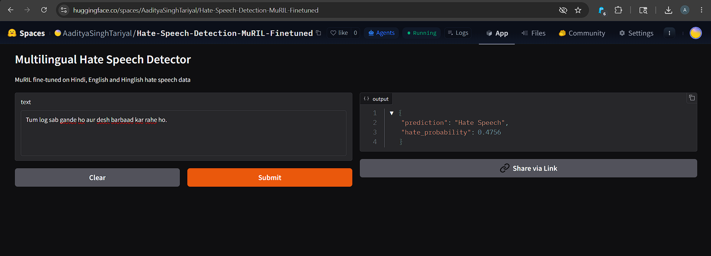

# Multilingual Hate Speech Detection using MuRIL

A multilingual hate speech detection system built using **MuRIL (Multilingual Representations for Indian Languages)** for classifying text as:

- Hate Speech
- Not Hate Speech

Supported languages:
- Hindi
- English
- Hinglish (code-mixed Hindi + English)

This project includes:
- Fine-tuning MuRIL on a multilingual hate speech dataset
- Model optimization using weighted loss, early stopping, and threshold tuning
- Deployment as an interactive web app on Hugging Face Spaces using Gradio

---

## Project Overview

Social media platforms and online communities frequently contain harmful or hateful content across multiple languages.

This project focuses on building a multilingual hate speech detection system capable of understanding:

- Hindi text
- English text
- Hinglish/code-mixed text

The deployed application performs real-time inference for multilingual text moderation and classification.

---

## Features

- Multilingual hate speech detection
- Hindi, English, and Hinglish support
- Real-time predictions
- Confidence score output
- Interactive Gradio web interface
- Fully self-contained deployment on Hugging Face Spaces

---

## Model Details

- **Base Model:** MuRIL
- **Framework:** PyTorch
- **Library:** Hugging Face Transformers
- **Frontend:** Gradio
- **Deployment:** Hugging Face Spaces

---

## Dataset

Training dataset:
- Combined multilingual hate speech dataset

Dataset size:
- **29,550+ samples**

Language distribution:
- English: ~52%
- Hindi: ~33%
- Hinglish: ~15%

Labels:
- `0` → Not Hate Speech
- `1` → Hate Speech

---

## Training Strategy

Techniques used for improving performance:

- Weighted Cross Entropy Loss
- Early Stopping
- Learning Rate Tuning
- Threshold Tuning
- Best model checkpoint selection

---

## Performance

| Metric | Score |
|---|---|
| Accuracy | 73% |
| F1 Score (Hate Class) | 0.70 |
| Precision | 0.73 |
| Recall | 0.68 |

---

## Live Demo

### Hugging Face Space

[Live Demo](https://huggingface.co/spaces/AadityaSinghTariyal/Hate-Speech-Detection-MuRIL-Finetuned)

---

## Application Screenshot



---

## Project Structure

```bash
multilingual-hate-speech-detection/
│
├── app.py
├── requirements.txt
├── README.md
│
├── notebooks/
│   └── training_notebook.ipynb
│
└── images/
    └── app_screenshot.png
```

---

## Installation

Clone repository:

```bash
git clone https://github.com/YOUR_USERNAME/multilingual-hate-speech-detection.git
cd multilingual-hate-speech-detection
```

Install dependencies:

```bash
pip install -r requirements.txt
```

---

## Run Locally

```bash
python app.py
```

---

## Example Predictions

### Example 1

Input:

```text
You are a very kind person.
```

Output:

```text
Not Hate Speech
```

### Example 2

Input:

```text
Tum log sab gande ho aur desh barbaad kar rahe ho.
```

Output:

```text
Hate Speech
```

---

## Future Improvements

- Multi-class classification:
  - Hate
  - Offensive
  - Neutral
- Larger balanced dataset
- Explainable AI
- REST API support
- Ensemble architectures

---

## Tech Stack

- Python
- PyTorch
- Transformers
- MuRIL
- Gradio
- Hugging Face Spaces

---

## Author

**Your Name**

GitHub: YOUR_GITHUB_URL  
LinkedIn: YOUR_LINKEDIN_URL
